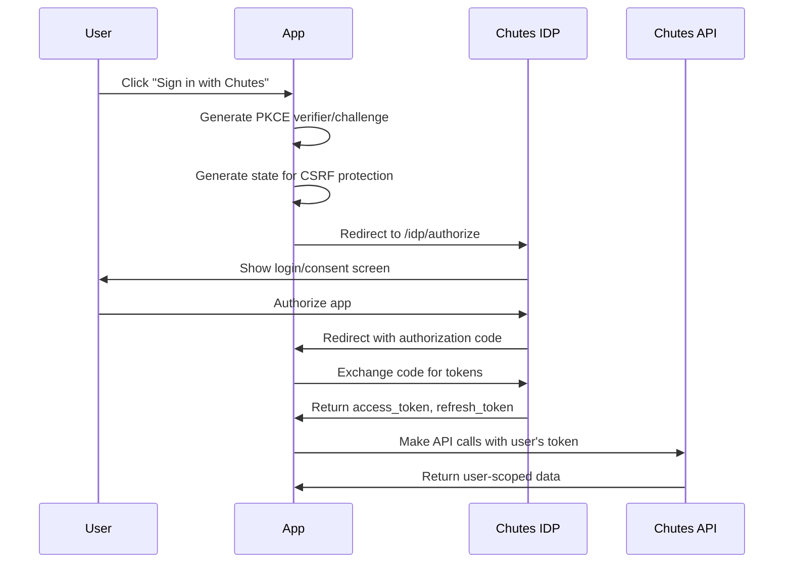

# Sign in with Chutes

**Sign in with Chutes** is an OAuth 2.0 authentication system that allows users to sign into your application using their Chutes account. This enables your app to make API calls on behalf of users, with billing automatically handled through their Chutes account.

## Why Use Sign in with Chutes?

Traditional API key authentication works well for server-side applications, but for user-facing applications, OAuth provides significant advantages:

- **User-Scoped Access**: Each user authenticates with their own Chutes account
- **Automatic Billing**: API usage is billed to the user's account, not yours
- **Granular Permissions**: Request only the scopes your app needs
- **Security**: No API keys stored in client-side code
- **Trust**: Users see exactly what permissions they're granting

## Official SDK Repository

The fastest way to add "Sign in with Chutes" to your application is using the official SDK repository:

**[github.com/chutesai/Sign-in-with-Chutes](https://github.com/chutesai/Sign-in-with-Chutes)**

This repository is designed for **vibe coding** with AI assistants like Cursor, Windsurf, or GitHub Copilot. Simply point your AI assistant to the repository, and it can:

- Copy the integration files into your project
- Set up the OAuth flow automatically
- Configure environment variables
- Add sign-in components to your UI

### Using with AI Coding Assistants

When working with an AI coding assistant, you can reference the SDK repository directly:

```
Add "Sign in with Chutes" to my app using the SDK at:
https://github.com/chutesai/Sign-in-with-Chutes
```

The repository includes:

| Directory                  | Contents                                        |
| -------------------------- | ----------------------------------------------- |
| `packages/nextjs/`         | Copy-paste integration files for Next.js        |
| `scripts/`                 | Setup wizard and OAuth app registration scripts |
| `examples/nextjs-minimal/` | Working demo application                        |
| `docs/`                    | Framework-specific guides and troubleshooting   |

### Manual Quick Start

If you prefer a manual approach:

```bash
# Clone the repository
git clone https://github.com/chutesai/Sign-in-with-Chutes.git

# Install dependencies and run the setup wizard
cd Sign-in-with-Chutes
npm install
npx tsx scripts/setup-chutes-app.ts
```

The setup wizard will guide you through registering your OAuth app and generating credentials.

## How It Works

Sign in with Chutes implements the OAuth 2.0 Authorization Code flow with PKCE (Proof Key for Code Exchange) for enhanced security.



### Flow Overview

1. **User Initiates Login**: User clicks "Sign in with Chutes" in your app
2. **Authorization Request**: Your app redirects to Chutes with a PKCE challenge
3. **User Consent**: User logs in and approves the requested permissions
4. **Authorization Code**: Chutes redirects back with a temporary code
5. **Token Exchange**: Your server exchanges the code for access/refresh tokens
6. **API Access**: Use the access token to make API calls on behalf of the user

## Available Scopes

When registering your OAuth app, you specify which permissions (scopes) your app requires:

| Scope                      | Description                     | Use Case                    |
| -------------------------- | ------------------------------- | --------------------------- |
| `openid`                   | OpenID Connect authentication   | Required for all apps       |
| `profile`                  | Access to username, email, name | User profile display        |
| `chutes:invoke`            | Make AI API calls               | Apps using Chutes AI models |
| `chutes:invoke:{chute_id}` | Invoke a specific chute only    | Limited access to one chute |
| `account:read`             | Read account information        | Account dashboards          |
| `billing:read`             | Read balance and credits        | Display user's balance      |

**Best Practice**: Only request the scopes your application actually needs. Users are more likely to trust apps that request minimal permissions.

## Quick Start

### 1. Register Your OAuth App

Register your application with Chutes to receive client credentials:

```bash
curl -X POST "https://api.chutes.ai/idp/apps" \
  -H "Authorization: Bearer $CHUTES_API_KEY" \
  -H "Content-Type: application/json" \
  -d '{
    "name": "My Application",
    "description": "Description of your app",
    "redirect_uris": ["https://yourapp.com/api/auth/callback"],
    "homepage_url": "https://yourapp.com",
    "allowed_scopes": ["openid", "profile", "chutes:invoke"]
  }'
```

You'll receive:

- `client_id` - Your app's public identifier (e.g., `cid_xxx`)
- `client_secret` - Your app's secret key (e.g., `csc_xxx`) - keep this secure!

### 2. Build the Authorization URL

Redirect users to the authorization endpoint with your app details:

```
https://api.chutes.ai/idp/authorize?
  client_id=YOUR_CLIENT_ID&
  redirect_uri=https://yourapp.com/api/auth/callback&
  response_type=code&
  scope=openid+profile+chutes:invoke&
  state=RANDOM_STATE_VALUE&
  code_challenge=PKCE_CHALLENGE&
  code_challenge_method=S256
```

### 3. Handle the Callback

After the user authorizes your app, they're redirected to your callback URL with an authorization code:

```
https://yourapp.com/api/auth/callback?code=AUTH_CODE&state=RANDOM_STATE_VALUE
```

### 4. Exchange Code for Tokens

Exchange the authorization code for access and refresh tokens:

```bash
curl -X POST "https://api.chutes.ai/idp/token" \
  -H "Content-Type: application/x-www-form-urlencoded" \
  -d "grant_type=authorization_code" \
  -d "client_id=YOUR_CLIENT_ID" \
  -d "client_secret=YOUR_CLIENT_SECRET" \
  -d "code=AUTH_CODE" \
  -d "redirect_uri=https://yourapp.com/api/auth/callback" \
  -d "code_verifier=PKCE_VERIFIER"
```

### 5. Make Authenticated Requests

Use the access token to make API calls:

```bash
curl -H "Authorization: Bearer ACCESS_TOKEN" \
  https://api.chutes.ai/users/me
```

## API Endpoints

| Endpoint                | Method | Description                      |
| ----------------------- | ------ | -------------------------------- |
| `/idp/authorize`        | GET    | Start OAuth flow (user redirect) |
| `/idp/token`            | POST   | Exchange code for tokens         |
| `/idp/userinfo`         | GET    | Get authenticated user's profile |
| `/idp/token/introspect` | POST   | Validate a token                 |
| `/idp/apps`             | POST   | Register a new OAuth app         |
| `/users/me`             | GET    | Get detailed user information    |

### OpenID Configuration

For OpenID Connect discovery:

```
https://idp.chutes.ai/.well-known/openid-configuration
```

## Security Considerations

### PKCE (Proof Key for Code Exchange)

PKCE prevents authorization code interception attacks. Always generate a unique code verifier and challenge for each authorization request:

1. Generate a random `code_verifier` (43-128 characters)
2. Create the `code_challenge` as `BASE64URL(SHA256(code_verifier))`
3. Send the challenge with the authorization request
4. Send the verifier with the token exchange request

### State Parameter

The `state` parameter prevents CSRF attacks:

1. Generate a random state value before redirecting
2. Store it in the user's session
3. Verify it matches when handling the callback

### Token Storage

- **Access tokens** expire after approximately 1 hour
- **Refresh tokens** can be used to obtain new access tokens
- Store tokens in HttpOnly cookies to prevent XSS attacks
- Never expose tokens to client-side JavaScript

### Client Secret Protection

- Never expose your `client_secret` in client-side code
- All token operations should happen on your server
- Use environment variables for credential storage

## Token Refresh

When an access token expires, use the refresh token to obtain a new one:

```bash
curl -X POST "https://api.chutes.ai/idp/token" \
  -H "Content-Type: application/x-www-form-urlencoded" \
  -d "grant_type=refresh_token" \
  -d "client_id=YOUR_CLIENT_ID" \
  -d "client_secret=YOUR_CLIENT_SECRET" \
  -d "refresh_token=REFRESH_TOKEN"
```

## Framework Guides

For step-by-step implementation guides, see:

- **[Next.js Guide](nextjs)** - Complete implementation for Next.js applications

## Next Steps

- Review the [Vercel AI SDK Integration](/docs/integrations/vercel-ai-sdk) for using authenticated tokens with AI features
- Check out the [API Reference](/docs/api-reference/authentication) for detailed endpoint documentation
- Join our [Discord community](https://discord.gg/wHrXwWkCRz) for support
